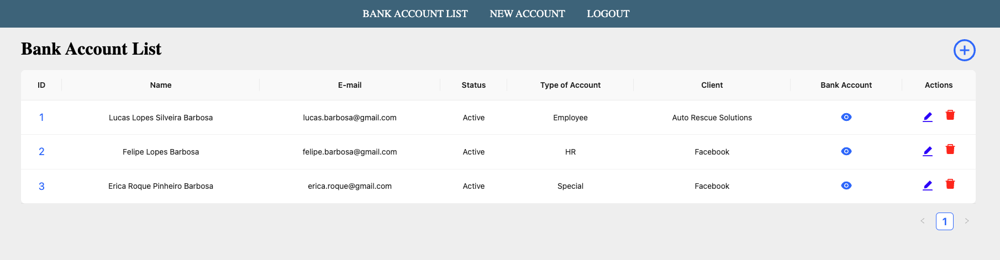

# Account App

In order to study and improve my knowledge of the JavaScript stack, the company that I work for proposed to create POC (Proof of Concept) using NodeJs and React.



## The Problem

Let's imagine that you did an interview for some company and were approved in the process.

All company needs a lot of information about you to know who are you and to use during the contract creation, profile information, check of criminal antecedents, the bank account information to pay your salary every month, and so on.

Ok, but what about the problem? The problem (at least for me) is that this change of information is completely using email most part of the time.

In my opinion, is boring to fill out a lot of forms using some text edits as the Office from Microsoft, when we need to update some information or consult if the data that we provided are updated and correct.

To summarize, the reasons above are only some points, but we could list several points from the company who is contracting and for us as candidates to prove how is a task that could be improved.

## How to configure

### Backend config

* Open a terminal
* Clone this repo on your machine: `git clone https://github.com/lucas-lopes/account-app`
* Enter on `account-app` folder and then on `backend` folder to configure the dependencies to run the backend side:

```bash
cd account-app
cd backend
npm install
```

* When finish the installation of the dependencies, you can start the backend:

```
node index.js
```

The backend side is ready to receive requisitions from the frontend app.

### Frontend config

* Create a new terminal window.
* Now we need to do the same cofiguration to the frontend: 

```bash
cd account-app
cd frontend
npm install
```

* When finish the installation of the dependencies, you can start the frontend:

```js
npm start
```

The front side is ready to do requisitions to the backend app. Go to the following address using your browser:

[Account App](http://localhost:3000)

How to get a existing user account or create a new, you can see bellow.

## How to test

We are not using database on this application, instead we have an array on our backend side to store some accounts and to save new ones using the `account-app`.

We have the following accounts created to be used:

```json
{
    "username": "lucas.barbosa@gmail.com",
    "password": "123",
    "typeOfAccount": "Employee"
}
```

```json
{
    "username": "felipe.barbosa@gmail.com",
    "password": "123",
    "typeOfAccount": "HR"
}
```

```json
{
    "username": "erica.roque@gmail.com",
    "password": "123",
    "typeOfAccount": "Special"
}
```

* The `Employee` account, the user has access only to its account, can see and edit its bank account info.
* The `HR` and `Special` accounts, the user can list all users, see the account and bank account information, edit, delete, and create accounts.

Feel free to create a new account if you prefer it.
